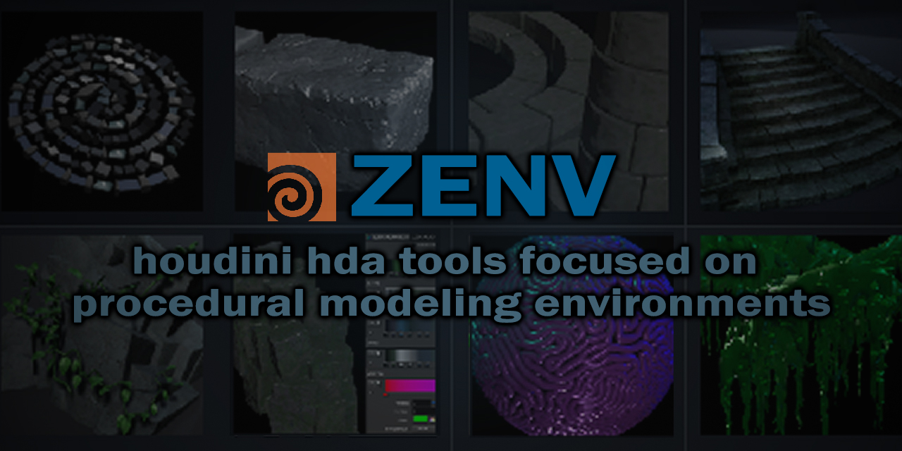
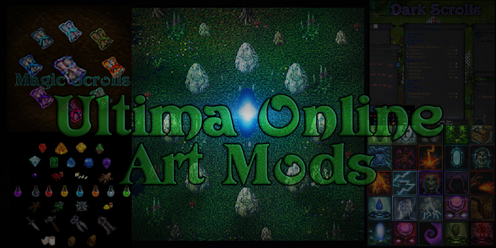
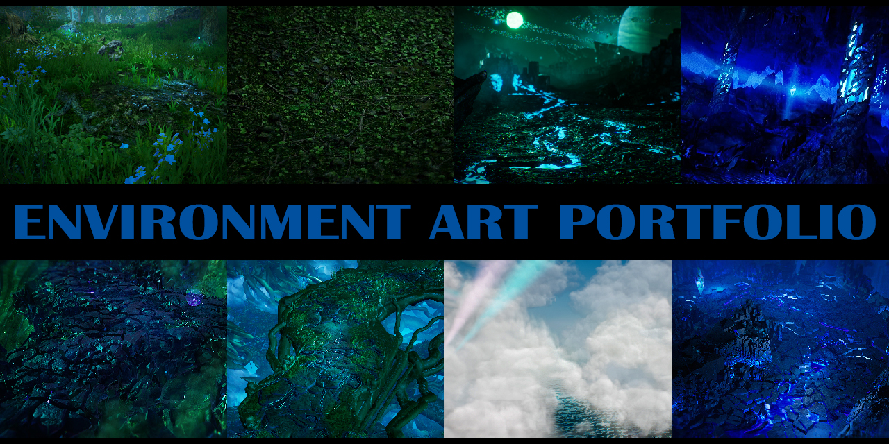
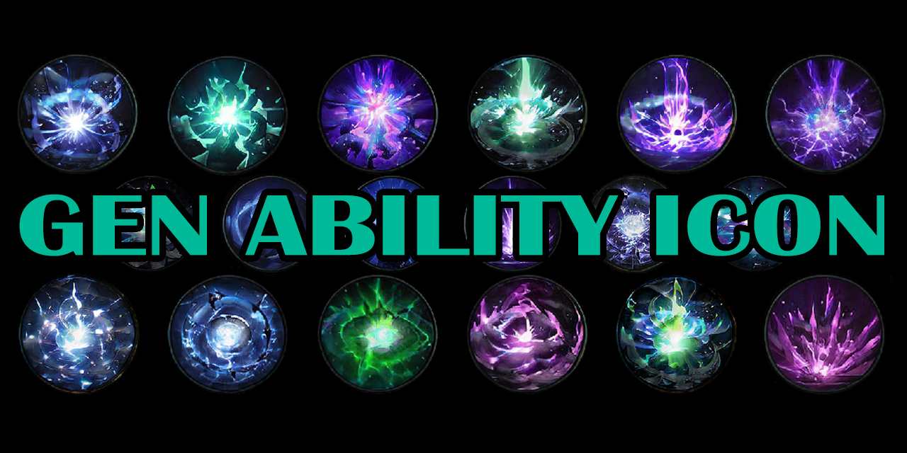
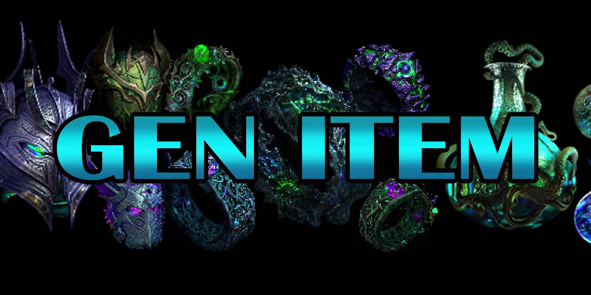

<table>

<tr>
<td align="center"><a href="https://github.com/CorvaeOboro/zenv">  zenv houdini tools</a></td>
<td align="center"><a href="https://github.com/CorvaeOboro/ultima_online_mods"> ultima art mods</a></td>
</tr>

<tr>
<td align="center"><a href="https://corvaeoboro.github.io/">  art folio </a></td>
<td align="center"><a href="https://github.com/CorvaeOboro/clouds_unreal"> clouds unreal</a></td>
</tr>

<tr>
<td align="center"><a href="https://github.com/CorvaeOboro/gen_ability_icon">  gen ability icon </a></td>
<td align="center"><a href="https://github.com/CorvaeOboro/gen_item">  gen item </a></td>
</tr>

</table>
